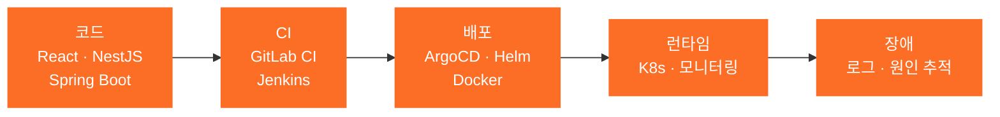

# 서명석 · Myungseok Seo

**DevOps Engineer · Full-Stack Developer**

코드부터 런타임까지, 혼자 건너다닙니다

7년차 · 플래티어 IDT GitLab 엔지니어 · 경기 성남 · 원격 작업

 

 

<b>이 다섯 칸을 전부 혼자 지나갑니다.</b> 개발자는 보통 첫 칸까지, 인프라 담당은 보통 셋째 칸부터입니다.

 

---

## 🔀 이런 상황에 부르세요

가장 잘 하는 일은 **개발과 인프라 사이에 끼어서 아무도 못 잡는 문제**입니다.

> **"로컬에선 되는데 서버에선 안 됩니다"**
> **"빌드는 통과하는데 컨테이너에서만 죽습니다"**
> **"배포는 됐는데 느립니다. 코드 문제인지 리소스 문제인지 모르겠습니다"**
> **"개발팀은 인프라 탓하고, 인프라는 코드 탓합니다"**

이런 건 **양쪽을 다 봐야** 잡힙니다.
저는 코드를 읽고, 그 코드가 도는 컨테이너도 열어봅니다.

 

## 🧰 이런 일을 받습니다

### 💻 개발

<table>
<tr><th width="26%">무엇을</th><th width="46%">실제로 해본 것</th><th width="28%">어디서</th></tr>
<tr>
<td><b>백엔드 · API</b></td>
<td>LMS 백엔드 <b>단독 전담</b> — 강의·수강생 CRUD, 진도율 체크, <code>aggregate</code> 기반 통계 API, video.js 연동 5초 단위 저장 Spring Boot(Java 17) · NestJS · Express gRPC 음성 데이터 미들웨어 + S3</td>
<td>오베네프 와트 판도플랫폼</td>
</tr>
<tr>
<td><b>프론트엔드</b></td>
<td>React · Next.js · TypeScript Tailwind · MUI · shadcn/ui · Redux · Context API SEO 고려한 페이지 설계</td>
<td>와트 엔아이 오베네프</td>
</tr>
<tr>
<td><b>인증 · 연동</b></td>
<td>Keycloak SSO — 학사 사이트 ↔ LMS 두 서비스 연동 JWT + Redux 인증 학사 DB ↔ 서비스 DB 마이그레이션 시스템</td>
<td>오베네프</td>
</tr>
<tr>
<td><b>기획부터 배포까지</b></td>
<td>Figma 기획 → Next.js → Vercel 배포까지 <b>단독 진행</b> 크롤링 및 댓글 자동화 시스템</td>
<td>엔아이 개인 프로젝트</td>
</tr>
</table>

### ⚙️ 인프라 · DevOps

<table>
<tr><th width="26%">무엇을</th><th width="46%">실제로 해본 것</th><th width="28%">어디서</th></tr>
<tr>
<td><b>📡 WebRTC 실시간 통신</b> 연결 안 되는 문제 전문</td>
<td>STUN / TURN / ICE 구성 및 Coturn 운영 Janus · Jitsi · Kurento · aiortc 미디어 서버 구축 NAT 뒤 연결 실패, 네트워크 문제 분석</td>
<td>와트</td>
</tr>
<tr>
<td><b>GitLab · CI/CD</b> 구축 · 이관 · 표준화</td>
<td>GitLab CE <b>직접 구축·운영</b> (SaaS 아님) GitLab Runner + Docker CI 구성 및 트러블슈팅 Jenkins Pipeline, ArgoCD + Kustomize 자동화 SonarQube 품질 게이트 · Harbor / Nexus Registry</td>
<td>플래티어 와트 라온피플</td>
</tr>
<tr>
<td><b>쿠버네티스 환경 구축</b></td>
<td>kubespray · kubeadm로 온프렘 클러스터 <b>밑바닥부터</b> ingress-nginx · rook-ceph · Helm 구성 Azure AKS 리소스 및 권한 설계 Pod · PVC · NetworkPolicy 장애 분석</td>
<td>와트 오베네프 라온피플</td>
</tr>
<tr>
<td><b>모니터링 · 관측</b></td>
<td>Prometheus · Grafana · Thanos 구성 cAdvisor · Node Exporter 컨테이너/호스트 관측 Grafana API로 대시보드 배포 자동화</td>
<td>와트 라온피플</td>
</tr>
<tr>
<td><b>서버 · DB 장애 분석</b></td>
<td>Ubuntu 구축, Nginx Reverse Proxy · LB AWS EC2 · Naver Cloud · GCP PostgreSQL · MySQL · MSSQL · MongoDB · Redis DNS · 인증서 · 권한 · WebSocket 이슈</td>
<td>와트 오베네프</td>
</tr>
</table>

### 🔀 둘 다 걸친 일 &nbsp;— 여기가 제일 자신 있습니다

<table>
<tr><th width="26%">무엇을</th><th width="74%">왜 양쪽을 알아야 하는지</th></tr>
<tr>
<td><b>앱 컨테이너화</b></td>
<td>Dockerfile은 인프라 파일이 아니라 <b>그 앱을 아는 사람이 써야</b> 하는 파일입니다. 빌드 캐시, 레이어 순서, 런타임 의존성은 코드를 읽어야 잡힙니다.</td>
</tr>
<tr>
<td><b>CI 파이프라인 구축</b></td>
<td>파이프라인만 짜면 절반입니다. <b>거기서 깨지는 코드를 같이 고쳐야</b> 끝납니다. CI에서만 실패하는 테스트, 환경 차이로 깨지는 빌드까지 봅니다.</td>
</tr>
<tr>
<td><b>개발환경 표준화</b></td>
<td>Docker Compose 기반으로 <b>모든 개발자가 같은 환경</b>에서 돌게 만듭니다. "제 컴퓨터에선 되는데요"를 없애는 작업입니다.</td>
</tr>
<tr>
<td><b>환경변수 · 시크릿 정리</b></td>
<td>env 관리가 무너지면 브랜치·버전 관리까지 같이 무너집니다. 실제로 그렇게 꼬인 프로젝트를 수습해봤습니다.</td>
</tr>
<tr>
<td><b>로깅 설계</b></td>
<td>장애가 났을 때 <b>원인을 찾을 수 있는 로그</b>를 코드 단에서 설계합니다. 로그가 부실하면 인프라를 아무리 봐도 원인이 안 나옵니다.</td>
</tr>
<tr>
<td><b>성능 · 장애 원인 판별</b></td>
<td>느린 게 쿼리인지, 코드인지, 리소스인지, 네트워크인지 <b>가려냅니다.</b> 이걸 못 가리면 엉뚱한 곳에 돈을 씁니다.</td>
</tr>
</table>

> 🔒 **폐쇄망 · 망분리는 상시 외주로 받지 않습니다.**
> 현장 반입과 상주가 필요한 일이 대부분이라, 본업과 병행하면 제대로 못 해드립니다.
> 다만 **오프라인 레지스트리 구성이나 반출입 구조 설계 같은 문서·설계 단계 자문은 원격으로 가능**합니다.
> 실제로 2년 넘게 겪은 환경이라 어디서 터지는지는 압니다.

 

## ⏱️ 이렇게 일합니다

<table>
<tr>
<td width="22%"><b>가능한 시간</b></td>
<td>본업이 있어 <b>평일 저녁과 주말</b>에 작업합니다. 그래서 <b>단발성 자문</b>과 <b>단기 프로젝트</b>를 선호합니다. 상주가 필요한 일은 맡지 않습니다.</td>
</tr>
<tr>
<td><b>진행 방식</b></td>
<td><b>원격 100%</b>. 필요하면 화상으로 같이 화면 보면서 잡습니다.</td>
</tr>
<tr>
<td><b>시작할 때</b></td>
<td>먼저 <b>지금 뭐가 안 되는지</b>부터 봅니다. 범위를 문서로 맞추고 손을 댑니다. 기획이 덜 된 상태로 들어가면 왕복만 늘어난다는 걸 비싸게 배웠습니다.</td>
</tr>
<tr>
<td><b>남기는 것</b></td>
<td>끝나면 <b>다음 사람이 읽고 운영할 수 있는 문서</b>를 같이 드립니다. 저 없이 굴러가야 끝난 겁니다.</td>
</tr>
<tr>
<td><b>안 맡는 일</b></td>
<td>제가 안 해본 영역은 <b>안 해봤다고 말씀드립니다.</b> 되는 척하고 배우면서 하는 게 제일 비쌉니다.</td>
</tr>
</table>

 

## 🚀 만든 것

<b>복지 내비게이터</b> — 자기 조건을 모르는 사람을 위한 복지 안내 &nbsp;<a href="https://welfare-navigator.vercel.app">🔗 라이브</a>

 

자기가 중위소득 몇 %인지 몰라도, 상황을 일상어로 적으면 받을 수 있는 지원을 찾아줍니다.

> 정부 서비스는 **조건을 정확히 아는 사람**에게 답합니다.
> 이건 **자기 조건을 모르는 사람**에게 답합니다.

기존 서비스를 직접 클릭해 측정하고, 그 숫자를 목표로 잡았습니다.

| | 기존 서비스 (실측) | 복지 내비게이터 |
|---|---|---|
| 결과까지 상호작용 | 11회 | **1회** |
| 결과 전 필수 입력 | 4종 | **0종** |
| 결과 건수 | 50개 | **5~8개** (근거·예상 금액 포함) |

`Next.js 16` `React 19` `TypeScript` `Tailwind` `Vercel`

<b>kuber-resource / docker-resource</b> — 운영하며 실제로 쓴 Helm 차트와 리소스 설정

 

검색해도 안 나와서 직접 정리한 것들입니다. 예제가 아니라 **실서비스에 올라간 설정**입니다.

- [kuber-resource](https://github.com/smshack/kuber-resource) — Helm 및 사용 리소스 정리
- [docker-resource](https://github.com/smshack/docker-resource) — 컨테이너 리소스 설정 정리

<b>devops-portfolio</b> — 오픈소스를 <i>운영 관점</i>에서 뜯어보는 기록 (진행 중)

 

기능이 아니라 **붙였을 때 뭐가 터지는지**를 봅니다. 현재 Keycloak.
→ [저장소](https://github.com/smshack/devops-portfolio)

 

## 📡 지금 하는 것

이 표는 매일 자동으로 갱신됩니다. 마지막 갱신 시각을 보시면 제가 살아 있는지 아실 수 있습니다. 최종 갱신 2026-09-09 12:26 KST

<table><tr><td valign="top" width="50%">

### 🔨 최근 작업
<!-- activity starts -->
**[git-basic](https://github.com/smshack/git-basic)** · 2일 전 chore: MIT 라이선스 추가

**[devops-portfolio](https://github.com/smshack/devops-portfolio)** · 2일 전 chore: MIT 라이선스 추가

**[docker-resource](https://github.com/smshack/docker-resource)** · 2일 전 chore: MIT 라이선스 추가

**[kuber-resource](https://github.com/smshack/kuber-resource)** · 2일 전 chore: MIT 라이선스 추가

**[MYNOTE](https://github.com/smshack/MYNOTE)** · 1개월 전 gitlab-cicd
<!-- activity ends -->

</td><td valign="top" width="50%">

### 📦 저장소
<!-- repos starts -->
**[git-basic](https://github.com/smshack/git-basic)** · 2일 전 Git · GitHub 사용 기초 정리 (한국어)

**[devops-portfolio](https://github.com/smshack/devops-portfolio)** · 2일 전 오픈소스를 운영 관점에서 뜯어보는 기록

**[docker-resource](https://github.com/smshack/docker-resource)** · 2일 전 실서비스에 올린 Docker Compose 리소스 모음

**[kuber-resource](https://github.com/smshack/kuber-resource)** · 2일 전 실서비스에 올린 Kubernetes / Helm 리소스 모음

**[program-language](https://github.com/smshack/program-language)** · 2일 전 프로그래밍 언어 기초 정리
<!-- repos ends -->

</td></tr></table>

 

## 📁 경력 · 7년

펼쳐서 보실 수 있습니다.

<b>(주)플래티어</b> · DevOps / GitLab 엔지니어 · <code>2026.07 ~ 재직중</code>

 

IDT 부서. 사내 GitLab / CI 플랫폼 운영.
모든 팀의 파이프라인이 지나가는 자리라, 조직이 어디서 반복해서 넘어지는지가 보입니다.

<b>주식회사 와트</b> (WATTCO) · Software / DevOps Engineer · <code>2024.07 ~ 2026.07</code> (2년 1개월)

 

**가장 넓은 층을 다룬 2년입니다.** 개발과 인프라를 동시에 맡았습니다.

**CI/CD · DevOps 환경 구축·운영**
- GitLab CE 기반 형상관리 및 CI/CD 환경 구축·운영
- Jenkins Pipeline을 활용한 빌드·배포 자동화
- GitLab Runner 및 Docker 기반 CI 환경 구성 및 트러블슈팅
- Docker Compose 기반 개발·운영 환경 구성
- SonarQube 코드 품질 관리 / Black Duck 오픈소스·보안 취약점 관리
- Harbor · Nexus 사내 Artifact 및 Container Registry 운영

**실시간 통신 / WebRTC 인프라**
- WebRTC 기반 실시간 통신 서비스 인프라 구축 및 운영
- STUN / TURN / ICE 환경 구성 및 Coturn 운영
- Janus, Jitsi, Kurento, aiortc 등 미디어 서버 검토·구축
- 실시간 영상·음성 통신 환경의 네트워크 및 연결 문제 분석

**망분리 · 폐쇄망 환경 대응**
- Air-Gapped 환경을 고려한 개발·배포 인프라 구성
- 내부 Package / Container Registry 및 오프라인 Artifact 관리 환경 검토
- 사설 CA 및 내부 DNS / 네트워크 환경을 고려한 서비스 구성
- 망분리 환경에서 소스코드·Artifact 반출입을 고려한 형상관리·배포 구조 검토

**컨테이너 · 쿠버네티스**
- kubeadm 및 Minikube 기반 클러스터 구성
- Pod, Service, PVC, Network Policy 등 리소스 운영 및 장애 분석

**서버 · 인프라**
- Ubuntu 서버 환경 구축 및 운영, Nginx Reverse Proxy 및 Load Balancer 구성
- AWS EC2 및 Naver Cloud 기반 인프라 구성
- PostgreSQL, MySQL, MSSQL, MongoDB, Redis 운영
- Prometheus, Grafana, cAdvisor, Node Exporter 모니터링 환경 구성

**웹 애플리케이션 개발**
- React, Next.js, TypeScript 프론트엔드 / Express, NestJS, Spring Boot(Java 17) 백엔드
- Context API, Tailwind CSS, MUI, shadcn/ui 기반 UI 구현

**장애 분석 및 기술 지원**
- GitLab, GitLab Runner, Jenkins, Docker, Kubernetes 등 개발 인프라 장애 원인 분석·해결
- 네트워크, DNS, 권한, 인증서, Container Registry, WebSocket 운영 이슈 트러블슈팅
- 개발팀의 빌드·배포 및 개발환경 기술 지원

<b>라온피플 주식회사</b> · DevOps · AI 플랫폼팀 · <code>2024.01 ~ 2024.06</code>

 

- Azure AKS 리소스 활용 및 계정 권한 관리
- Prometheus, Grafana, Thanos를 활용한 모니터링 세팅
- 모니터링 시스템 배포 자동화 (ArgoCD, Kustomize, Job + Grafana API 활용)

<b>주식회사 엔아이</b> · 웹마스터 / 개발팀장 · <code>2023.05 ~ 2024.01</code>

 

- **개발 프로세스 수립** — git flow 기반 개발문화 세팅, Notion·Slack 업무 체계
- **[자사 홈페이지 구축](https://www.nimarketing.co.kr/)** — Figma 기획부터 Vercel 배포까지 단독 진행, SEO 고려한 설계, 채널톡 연동
- **크롤링 및 댓글 자동화 시스템** — 광고 댓글 자동화 및 로깅

<b>(주)판도플랫폼</b> · 음성인식 미들웨어 · <code>2022.09 ~ 2023.05</code>

 

- STT / TTS를 활용한 주문 시스템 엔티티 생성 로직 미들웨어
- gRPC를 이용한 음성 데이터 중간 처리 및 S3 저장
- 배달 주소 검색 가중치 로직 구현
- 기존 로직 및 코드 최적화

<b>주식회사 오베네프</b> · 웹마스터 / 백엔드 단독 · <code>2020.10 ~ 2022.04</code> (1년 7개월)

 

**가장 넓은 층을 혼자 다룬 시기입니다.**

- **온프렘 K8s 환경 구축** (2021.09~) — kubespray로 직접 구축, ingress-nginx · rook-ceph를 Helm으로 구성, Prometheus & Grafana 모니터링
- **실습실 시스템** — `kubernetes/client-node`로 API 개발, 유저별 namespace 할당, 생성 시 Secret·PV 할당 및 Pod 생성, ingress-nginx로 웹 접근 제공
- **LMS 백엔드 전부 단독 개발** (Express + MongoDB) — 강의·수강생·강사 CRUD, 진도율 체크 API, `aggregate` 기반 admin 통계 API, video.js와 연동해 5초 단위 진도 저장 (React 측도 함께)
- **Keycloak SSO** (2021.08) — Docker + react-keycloak으로 학사 사이트 ↔ LMS 사이트 SSO 연동
- **DB 마이그레이션 시스템** — 대학교 학사 DB ↔ LMS DB, 생성·수정·삭제 비교 로직으로 주기적 연동
- **도메인 및 서버 관리** — GCP, 코로케이션 서버, nginx
- JWT + Redux 로그인, React 초기 구조 설계

<b>(주)엔리치소프트</b> · SQA · KT 과금팀 · <code>2018.08 ~ 2020.01</code> (1년 6개월)

 

- 서버 모니터링, 장애 초기 대응 및 전파
- 오라클 데이터 사용량 조회

장애가 실제로 어떻게 터지고 어떻게 번지는지를 여기서 배웠습니다.

 

 

## 🧱 다뤄본 것

배지 나열 대신 <b>어디서 굴려봤는지</b>로 적습니다.

| 층 | 무엇을 | 어디서 |
|---|---|---|
| **CI/CD** | GitLab CE · GitLab CI · Runner, Jenkins, ArgoCD, Kustomize, Helm | 사내 전 개발팀 파이프라인 운영, GitLab CE 직접 구축 |
| **품질·보안** | SonarQube, Black Duck, Harbor, Nexus, 사설 CA | 납품 대응 품질 게이트 및 사내 Registry 운영 |
| **인프라** | Kubernetes(kubespray · kubeadm · AKS), Docker, rook-ceph, ingress-nginx | 온프렘 클러스터 단독 구축, 폐쇄망 반입 |
| **관측** | Prometheus, Grafana, Thanos, cAdvisor, Node Exporter | AI 플랫폼 · 실서비스 모니터링 스택 구성 |
| **실시간 통신** | WebRTC, Coturn(STUN/TURN/ICE), Janus, Jitsi, Kurento, aiortc | 실시간 영상·음성 서비스 인프라 구축·운영 |
| **서버·네트워크** | Ubuntu, Nginx(Reverse Proxy · LB), DNS, 인증서, WebSocket | 서비스 운영 및 장애 트러블슈팅 |
| **클라우드** | AWS(EC2 · S3), Azure, GCP, Naver Cloud, Vercel, 코로케이션 | 서비스 운영·배포 |
| **백엔드** | Node.js, NestJS, Express, Spring Boot(Java 17), gRPC | LMS 단독 개발, 음성 미들웨어, 사내 API |
| **DB** | PostgreSQL, MySQL, MSSQL, MongoDB, Redis, Oracle | 다중 DB 환경 운영 |
| **프론트** | React, Next.js, TypeScript, Redux, Tailwind, MUI, shadcn/ui | LMS, 자사 홈페이지, 복지 내비게이터 |
| **인증** | Keycloak(SSO), JWT | 두 사이트 간 SSO 연동 |

 

---

### 📮 문의

**단발성 자문부터 단기 프로젝트까지** 받고 있습니다.
아직 정리가 안 된 상태여도 괜찮습니다 — 지금 막혀 있는 것 한 줄이면 충분합니다.

 

